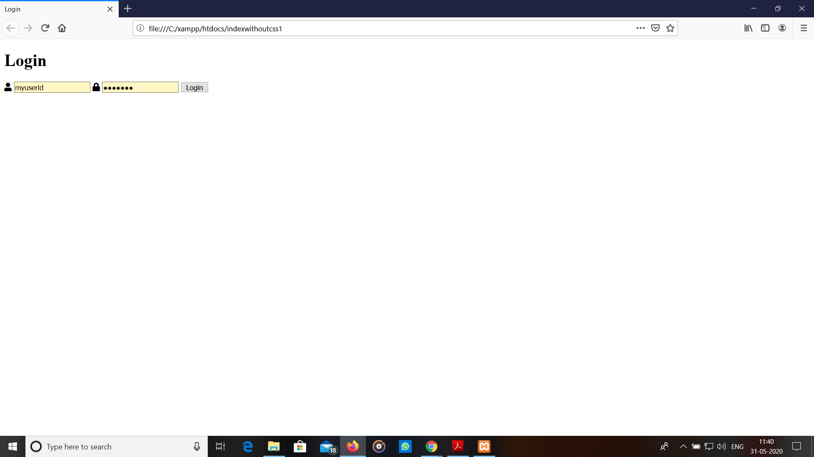
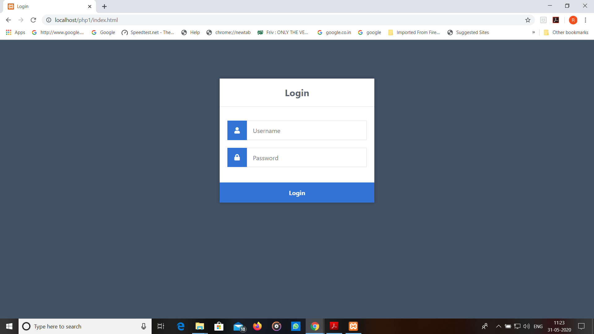
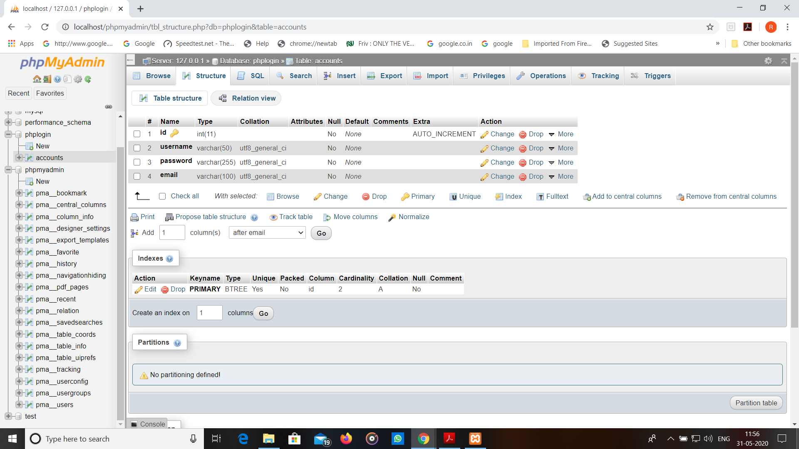
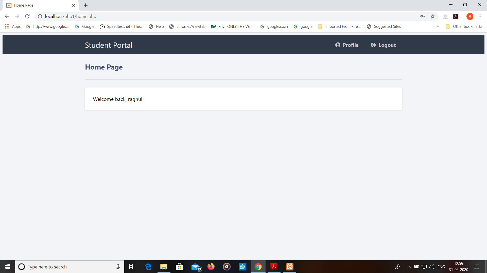
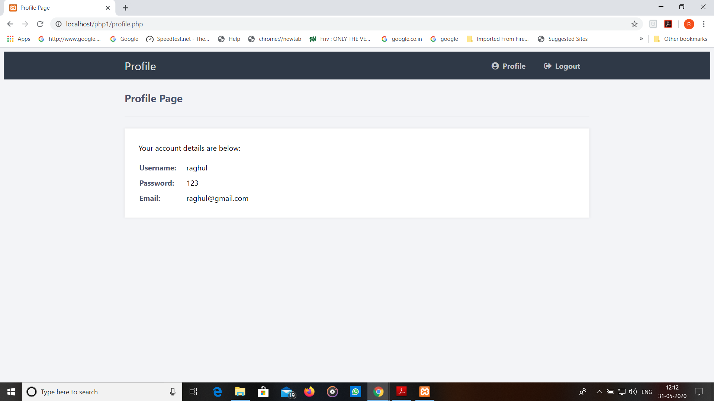
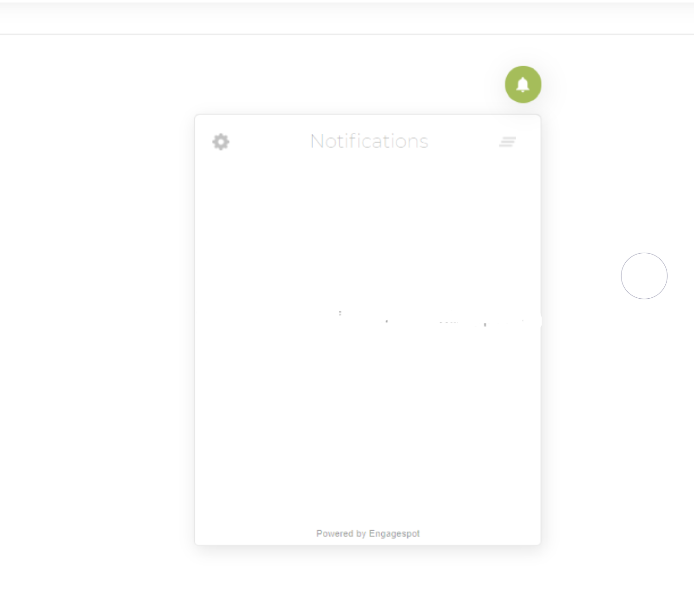

# Scalable inApp Notification System For Students

This project is devoloped exclusively for student where they can check their academic progress and if any new announcements is pushed by institution they get an in app notification as reminder for example as such in facebook...etc.

## Getting Started

 I have tested the complete source by using local host and xampp server. It works efficiently if you upload the phplogin sql file in clearDB as its database in Heruko open source application.
 
 There are a few steps we need to take before we create our secure login system and notification system , we need to set up our web server environment and make sure we have the required extensions enabled.
 
 ## API's 

  <b>Index.html</b>       — Login form created with HTML5 and CSS3, we don't need to use PHP in this file so we can just save it as HTML.
  
  <b>style.css</b>        — The stylesheet (CSS) for our secure login app.
  
  <b>authenticate.php</b> — Connect to the database, validate form data, retrieve database results, and create new sessions.
  
  <b>logout.php</b>       — Destroy the logged in sessions and redirect the user.
  
  <b>home.php </b>        — Basic home page for logged in users.
  
  <b>profile.php</b>      — Select the user's account from our MySQL database and display the result.
  
  For <b>notification system</b> i have used <b>Engagespot</b> for free push notification services:
  
  Link : https://engagespot.co/free-web-push-notifications/
  
### Prerequisites

To host as an public website u can execute the follwing code in <b>Heruko , Amazon Web Services (AWS), WordPress , Microsoft Azure</b> 

To excute the login and academic profile page we need to install the latest version of <b>xampp</b>

To install the latest version use the link given below:
  
 link: https://www.apachefriends.org/index.html


### Installing

<b>Step 1>
 
We need a login form for our websites users, so they can interact with it and enter their details, we will be using HTML and CSS 

Open up the index.html file with your favorite code editor and save it



open up our style.css file and add the following code:

after saving the css file addd the following code in <b>index.php<b>:
 
```
<link href="style.css" rel="stylesheet" type="text/css">
```

nd now if we reload the index.html file in our web browser our login form will look more appealing: 



For creating <b>DataBase</b> , you will need to access your MySQL database, either using phpMyAdmin or your preferred MySQL database management application.

If you're using phpMyAdmin follow these instructions:

    1.Navigate to: http://localhost/phpmyadmin/
    2.Click the Databases tab at the top
    3.Under Create database, type in phplogin in the text box
    4.Select utf8_general_ci as the collation
    5.Click Create
  
On <b>phpMyAdmin</b> this should look like:



We are going to start with the authentication, this will handle the form data that is sent from our index.html file.

open the file <b>authenticate.php</b>

If you want to use any password encryption method, you can simply replace the following code:

```
if ($_POST['password'] === $password) {
```

With:

```
if (password_verify($_POST['password'], $password)) {
```
Navigate to <b>http://localhost/phplogin/index.html</b>

The home page will be the first page our users see when they've logged-in, the only way they can access this page is if they're logged-in, they will be redirected back to the login page if they aren't.

Open <b>home.php</b>

To make the home page look more attractive i have added css and finally the page looks like : 



Creating the Profile Page:

The profile page will display the account information for the logged-in user.

Open <b>profile.php</b>

On reloading the page looks like: 



Creating the logout script

Open <b>logout.php</b>

On reloading <b>logout</b> can be used now.

For in inapp NOtification:

Use Engagespot to create an notification server in your website 

link:https://engagespot.co/free-web-push-notifications/

Notification System looks like:



after cdoing all the procedures in online platforms like <b>heruko , AWS , Wordpress ....etc connect <b>engagespot<\b>
 
 if you are using <b>WordPress<\b> then follow the steps:

    1.To install Engagespot to your WordPress blog or WooCommerce store, just download and install our Plugin from the WordPress plugin directory.

    2. And follow the instructions on this guide to setup the plugin

    3.Your Site Key is 10WoStMb82vGbKOU6D76f7yz5gYrgy

    4.Your API Key is uWxQAjw4aoVTpP14kIvM6UQi76mqoy
  
  In any other platforms Add the following code to every page (Just before the </head>tag) you want the bell icon to appear:
  
  ```
<script>window.Engagespot={},q=function(e){return function(){(window.engageq=window.engageq||[]).push({f:e,a:arguments})}},f=["captureEvent","subscribe","init","showPrompt","identifyUser","clearUser"];for(k in f)Engagespot[f[k]]=q(f[k]);var s=document.createElement("script");s.type="text/javascript",s.async=!0,s.src="https://cdn.engagespot.co/EngagespotSDK.2.0.js";var x=document.getElementsByTagName("script")[0];x.parentNode.insertBefore(s,x);Engagespot.init('10WoStMb82vGbKOU6D76f7yz5gYrgy');</script>
```
 
## Reason for using SQL Database

 - Scalability and Flexibility
 - Strong Data Protection
 - High Availability
 - High Performance
 - Management Ease

### Break down into end to end tests

Explain what these tests test and why

```
<script>window.Engagespot={},q=function(e){return function(){(window.engageq=window.engageq||[]).push({f:e,a:arguments})}},f=["captureEvent","subscribe","init","showPrompt","identifyUser","clearUser"];for(k in f)Engagespot[f[k]]=q(f[k]);var s=document.createElement("script");s.type="text/javascript",s.async=!0,s.src="https://cdn.engagespot.co/EngagespotSDK.2.0.js";var x=document.getElementsByTagName("script")[0];x.parentNode.insertBefore(s,x);Engagespot.init('10WoStMb82vGbKOU6D76f7yz5gYrgy');</script>
```
### And coding style tests

Explain what these tests test and why

```
Give an example
```

## Deployment

Add additional notes about how to deploy this on a live system

## Built With

* [Dropwizard](http://www.dropwizard.io/1.0.2/docs/) - The web framework used
* [Maven](https://maven.apache.org/) - Dependency Management
* [ROME](https://rometools.github.io/rome/) - Used to generate RSS Feeds

## Contributing

Please read [CONTRIBUTING.md](https://gist.github.com/PurpleBooth/b24679402957c63ec426) for details on our code of conduct, and the process for submitting pull requests to us.

## Versioning

We use [SemVer](http://semver.org/) for versioning. For the versions available, see the [tags on this repository](https://github.com/your/project/tags). 

## Authors

* **Billie Thompson** - *Initial work* - [PurpleBooth](https://github.com/PurpleBooth)

See also the list of [contributors](https://github.com/your/project/contributors) who participated in this project.

## License

This project is licensed under the MIT License - see the [LICENSE.md](LICENSE.md) file for details

## Acknowledgments

* Hat tip to anyone whose code was used
* Inspiration
* etc
